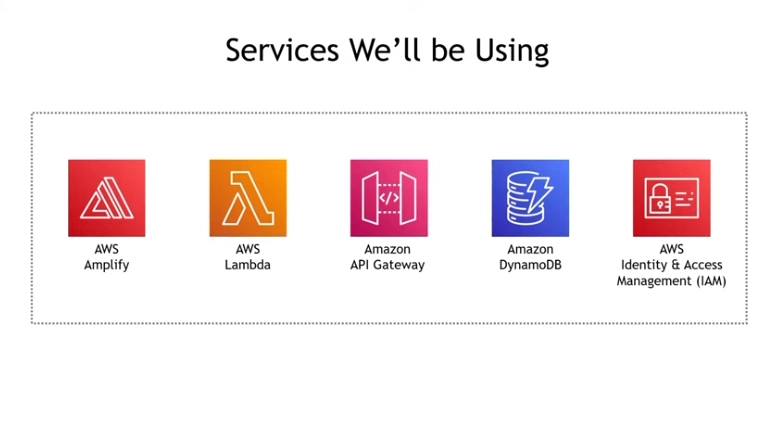
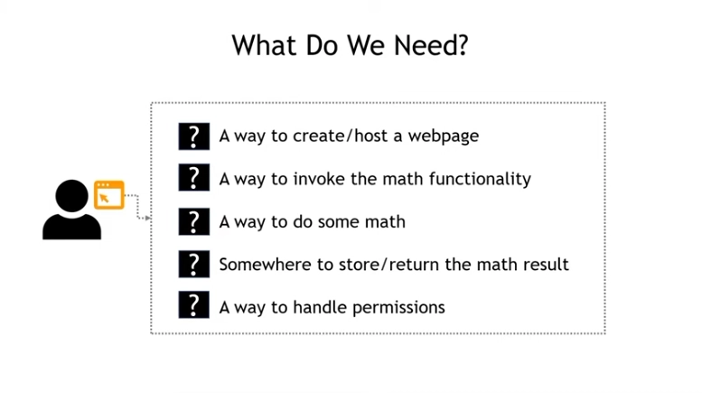

# Architect and Build an End-to-End AWS Web Application from Scratch

## Tutorial Credit
This GitHub repository and README.md page are based on a tutorial by Tiny Technical Tutorials. The tutorial video that inspired this repository can be found on [Tiny Technical Tutorials YouTube Channel](https://www.youtube.com/@TinyTechnicalTutorials). Please visit the channel and consider subscribing for more great tutorials.

## Overview of the Services and Application
In this comprehensive video, we will explore the seamless integration of five core AWS services to construct a robust end-to-end web application from the ground up. Our journey will take us through the following essential components:
- **Amplify:** Empowering developers with simplified front-end and back-end app development, including authentication, APIs, and hosting.
- **API Gateway:** Creating, publishing, and managing APIs at any scale to connect your applications to various AWS services.
- **Lambda:** Leveraging serverless computing to execute code in response to events, allowing for scalable and cost-effective architecture.
- **DynamoDB:** A fully managed NoSQL database for high-availability, seamless scaling, and low-latency performance.
- **IAM (Identity and Access Management):** Ensuring secure and controlled access to AWS resources, protecting your application and data.

<figcaption>Services Used</figcaption>

### Unleashing the Potential of Mathematics
While this application may seem deceptively simple, it serves as a powerful demonstration of how to seamlessly integrate core components essential for constructing robust real-world applications. This particular app takes two input numbers: a `base` and an `exponent`, and it performs a fundamental mathematical operation – exponentiation. When you click the `Calculate` button, it computes and displays the result, and behind the scenes, it also stores this valuable data in a DynamoDB table, opening up possibilities for further utilization.

In essence, this seemingly straightforward application showcases the core principles and technologies that serve as the foundation for much larger and more complex real-world projects. It's a testament to the elegance and versatility of modern cloud-based solutions.

## Prerequisites
Before getting started, here's what I needed to follow along with this tutorial:
- A text editor (e.g., Notepad++, Visual Studio Code).
- An AWS account and access to the AWS console.
- Basic knowledge of AWS. While this video wasn't a deep dive into any specific AWS service, it's helpful to have some basic understanding of AWS concepts.

<figcaption>What We Will Be Doing</figcaption>

## Constructing the Web Application

### Formulating and Hosting a Web Page

To initiate my web application, I used AWS Amplify, a practical solution for web creation and hosting. The process encompassed these essential steps:

1. **Local HTML Creation:** Began by crafting a local HTML file, such as index.html.

2. **HTML Development:** Populate the HTML file with the necessary code (you can reference the code in this repository under [index-original.html](https://github.com/HomelabTim/AWS/blob/main/AWS%20Web%20Application/index-original.html)).

3. **Zip the HTML:** Compress the HTML file into a zip archive for deployment.

4. **Amplify Deployment:** Utilize AWS Amplify to deploy the web page.

### Implementing Mathematical Calculations

The web application's mathematical capabilities rely on AWS Lambda, a serverless computing service. Here's how I accomplished this:

1. **Create a Python Lambda Function:** Develop a Python-based Lambda function from scratch.

2. **Write Python Code:** Craft Python code to execute mathematical calculations (you can reference the code in this repository under `index-original.html`).

3. **Test the Lambda Function:** Ensure the Lambda function functions correctly through rigorous testing.

### Triggering the Lambda Function

To invoke the Lambda function for mathematical operations, I employed Amazon API Gateway, creating a RESTful API endpoint:

1. **Establish a REST API:** Set up a REST API using Amazon API Gateway.

2. **Add a POST Method:** Configure a POST method within the API to trigger the Lambda function.

3. **CORS Enablement:** Enable Cross-Origin Resource Sharing (CORS) to permit web page calls to the API.

4. **Deploy the API:** Deploy the API for full functionality.

### Storing Results and Managing Permissions

Amazon DynamoDB, a NoSQL database service, was chosen for storing mathematical results and permissions management:

1. **DynamoDB Table Creation:** Establish a DynamoDB table dedicated to storing mathematical results.

2. **IAM Role Definition:** Define an Identity and Access Management (IAM) role to grant the Lambda function the necessary permissions.

3. **Lambda-DynamoDB Integration:** Modify the Lambda function to save results in DynamoDB.

## Finalizing and Testing

The concluding steps revolved around enhancing the web page for API calls, response handling, and results presentation:

1. **JavaScript Integration:** Update the JavaScript code on the web page to initiate API calls.

2. **Response Handling:** Implement code for handling API responses and displaying results on the web page.

3. **Rigorous Testing:** Thoroughly test the web application with various inputs to ensure its functionality.

## Conclusion

In summary, I successfully constructed an end-to-end web application using AWS services. This journey covered web page creation with `AWS Amplify`, serverless computing via `Lambda`, RESTful APIs with `API Gateway`, and data storage in `DynamoDB`. Armed with this knowledge, I can now embark on more complex AWS projects.